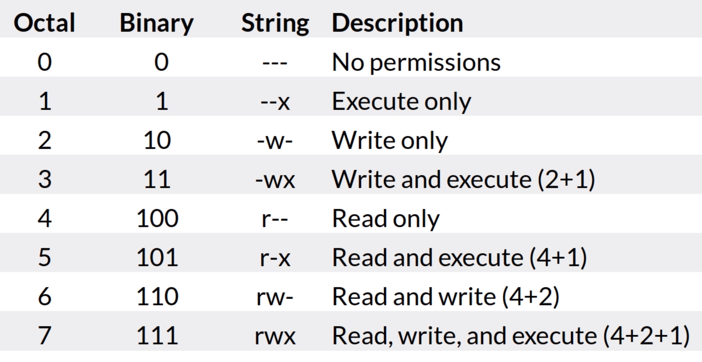
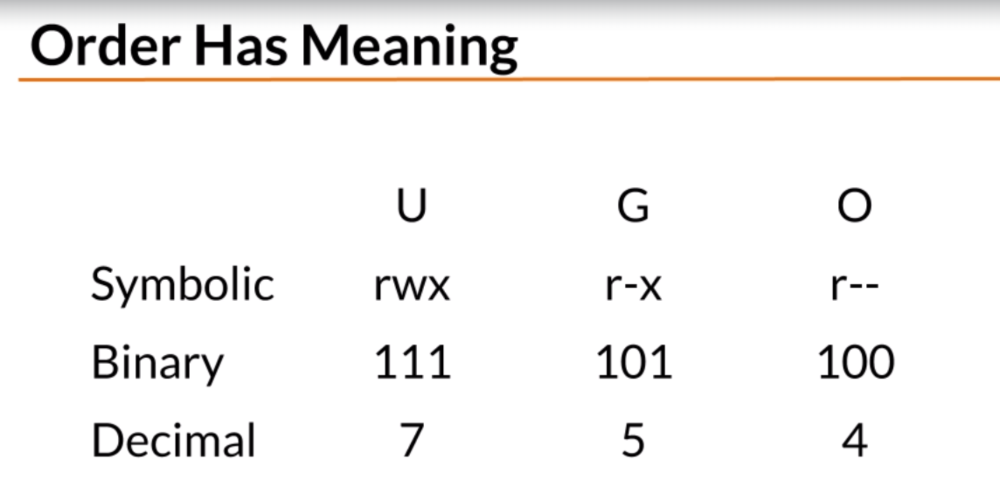
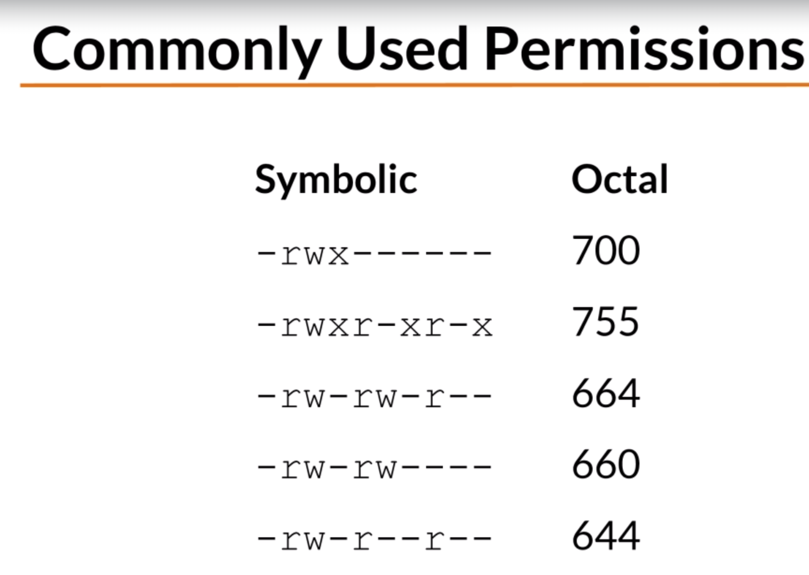

# File and Directory Permission

## Fundamentals
| Symbol | Type |
| ----------- | ----------- |
| - | Regular file |
| d | Directory |
| l | Symbolic Link |

| Symbol | Permission |
| ----------- | ----------- |
| r | Read |
| w | Write |
| x | Execute |

## Permissions Categories
| Symbol | Category |
| ----------- | ----------- |
| u | User |
| g | Group |
| o | Others |
| a | All |

### Groups
- Every user is in at least one group
- Users can belong to many groups
- Groups are used to organize users

## Changing Permissions
| Item | Meaning |
| ----------- | ----------- |
| chmod | Change mode command |
| ugoa | User category, user, group, other, all |
| +-= | Add, Substract, or set permissions |
| rwx | Read, Write, Execute |

## Numeric Based Permissions
| r | w | x | Value
| ----- | ----- | ----- | ----- |
| 0 | 0 | 0 | Value for off |
| 1 | 1 | 1 | Binary value for on |
| 4 | 2 | 1 | Base 10 value for on |

